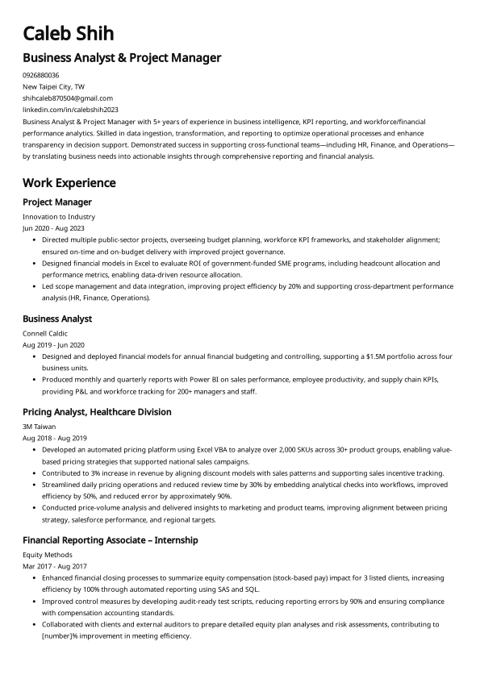

# BusinessIntelligenceinPractice

## 👋 About Me

Over the past year, my career has revolved around **data** — from joining large corporations to early-stage startups, handling numerous data pipelines, and building analytical reports.

From these experiences, I’ve observed that mature analytics and digital transformation initiatives revolve surrounding three core pillars:

- code, scripts, and the tools we choose,
- analytic and operational databases, and
- visualization and communication platforms.

While the business and technolgoy has been evolved rapidly, the **core challenge for analytics professionals remains the same**:

- *consistently delivering **high-quality, low-latency, and user-friendly analytics** that enable confident business decisions.*

It is not just about how well you can code in Python or use any advanced tools to handle data.

The key to success is also depending on **how well you can communicate and manage the changing nature of your data**, ensuring that everyone in the organization can confidently trust your data.

Additionally, you should see your report **not just as a Pivot Table from Excel**, but as a **product** — and you are the **product owner**.

That means providing reliable, high-quality data to your stakeholders, while keeping their best interests and decision needs in mind.

I hold an **MBA degree with a specialization in Finance Management**, and I recently graduated from the **British Columbia Institute of Technology (BCIT)** in Vancouver, Canada, where I focused on **Business Intelligence and Artificial Intelligence**, and began a new role in **Business Intelligence development and analysis**.

Through many career transitions and projects I’ve done, I’ve understand that — regardless of industry or company size — the challenges around **data quality, modeling, and cross-team alignment** are strikingly identical.

Throughout my career, my focus has been always on **bridging the gap between business and analytics**, building scalable **Business Intelligence models, semantic layers, data pipelines, and governance frameworks** that empower better, faster, and more confident decision-making across teams.

---

## 🌐 About This Repo

This Repo is for my **knowledge base** — a repository to document what I’ve learned in **data analytics, BI design, and data modeling**, and everything else related, to share insights that I find meaningful in my practice.

It’s also a way to **connect with professionals and communities** who share similar interests in **the evolving role of analytics**.

By building this space, I hope to create a place of learning, reflection, and collaboration — one that grows with both my experiences and the people who resonate with these topics.
